# Creating Games Using Castle Game Engine
Michalis Kamburelis
//:toc: left
:toc:
:toclevels: 4
:sectnums:
:source-highlighter: coderay
:docinfo1:

## Obsolete warning!

This article was nice back in 2018 -- it described the engine capabilities as of 2018. We grew a lot since then. Instead of this article, some better recommendations are now:

- Read https://castle-engine.io/documentation.php[engine documentation].

- Read https://github.com/castle-engine/bad-chess/[The bad way to play chess: 3D physics fun using Castle Game Engine]  article, also for _"Blaise Pascal Magazine"_, from 2023.

- Explore the template _"3D FPS game"_ from the https://castle-engine.io/editor[CGE visual editor].

Read on, to see how the engine looked like in 2018 :)

## Introduction

Games are a powerful medium to tell stories. They can be as interactive as we want, and they can freely gather ideas from other arts. Books, music, graphics, they all can be mixed into something wonderful.
//If only you have time and the right tools.

If you ask a game developer *why* did (s)he chose this career, the answer is often a beautiful game (s)he once enjoyed. For me, this game was _Wizardry 7_. An epic RPG game for DOS, with a magic and dangerous world, and a grand tale to uncover. I spent half a year of my life playing this game, and never had any regrets about it.

Now if you ask a game developer *how* did they manage to actually get into this career, they will often tell a story about a game studio they formed together with a friend. They envisioned a game they want to make, they signed a contract with a publisher, they downloaded and learned the necessary tools and got to work.

Personally, I did not receive the memo that you can get some ready tools to make games.
//At least not at the beginning.
Instead, I was fascinated by the free software and open-source movement around Linux, and I had this bold feeling that I can code everything I want in Pascal from scratch. So when I wondered _"how to make a game"_, I thought: _"Well, it should be simple. I can take this variable and call it `PlayerHealth`. And another one, and it will be `MonsterHealth`. Now if you put them both together in the same room..."_.

I knew I want to make my own tools to create games, and I want them to be open-source. That's how _Castle Game Engine_ was born.

Years later, we now have our own game studio, _Cat-astrophe Games_. We're making games using _Castle Game Engine_, and develop the engine as an open-source project, for everyone to benefit.
//my open-source game engine. Developing your own engine was risky, but it paid off.

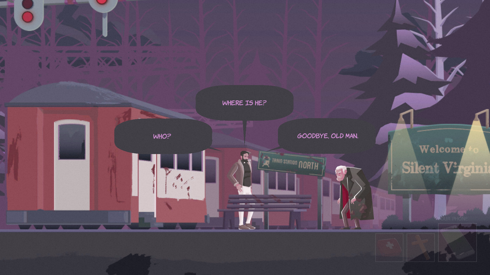
//Screenshot from The Unholy Society, by Cat-astrophe Games, using Castle Game Engine

## Advantages of Castle Game Engine

We have a lot of documentation on our website https://castle-engine.io/ , in particular we have a large manual for developers: https://castle-engine.io/manual_intro.php .

You can create all kinds of games. 3D or 2D, in Blender or Spine or any other authoring tool. We can load many file formats. Our website contains a section devoted to _Creating Game Data_ where we document the details: https://castle-engine.io/creating_data_intro.php .
//I never wanted to stop at developing a single genre of a game.

The engine is _cross-platform_, we support many desktop (_Windows, Linux, macOS_) and mobile (_Android, iOS_) platforms. We use modern OpenGL and OpenGLES rendering, planning also other renderers (Vulkan) in the future. We support a number of _services on mobile platforms_ to integrate your game with native system features, like analytics, in-app purchases and more.

The engine is not limited to developing games. You can use it to make any cross-platform application where visualization of some 3D or 2D stuff is important. For example you can make a 3D editing application, or a visualization of some industrial machinery. We use an international standard called X3D to define our _scene graph_. Absolutely _everything that you load from 3D files can also be created or modified by your Pascal code_.
//You can build procedural geometry.

The engine has _own user interface_ system.
//, with everything rendered inside the OpenGL(ES) context.
The system supports _anchors and smart scaling_ (to adjust to any screen resolution). The look of all the controls is configurable, which is often a necessity for games, where you want the user interface to match the look of your game.
//, to "immerse" the player in the experience.
The engine control can also be placed _inside a Lazarus form_, and surrounded by regular Lazarus (LCL) user interface.

The _open-source_ nature of the engine is a big advantage too.
//We have a number of developers using the engine for their own projects, and all developers can easily become contributors.
The engine is written using a clean modern Object Pascal language, and you use it to create games in Pascal as well. So every user is a potential engine developer. If you want to tweak the engine to your private needs -- you can do it. And if your modification improves the engine for everyone, we encourage you to send us a pull request.

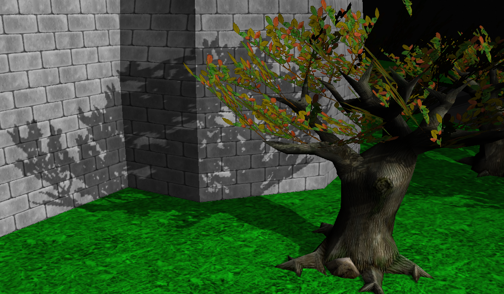

## Downloading and Installing

Let's jump in! We will make a simple 3D game using _Castle Game Engine_ from scratch.

The game data (models and textures), as well as the final source code, is available online on https://github.com/castle-engine/blaise-pascal-article-examples . You can follow this article to create your own source code, or you can just download a ready application from this repository. Likewise, you can use our game assets, or you can create your own e.g. in Blender.
//You can get the
//can follow this article and create everything yourself, or you can
//your own
//I encourage you to use the data from this repository, and try to write your own source code from scratch, following this article. But if you get lost at any point, please consult the code there.
//If you get lost at some point, or just want to use our ready graphic assets -- go ahead and download it.

Start by downloading the _Castle Game Engine_ from https://castle-engine.io/ . This is a large zip file with the engine source code. Unpack it anywhere on your hard disk.

You will also need the latest version of FPC and Lazarus, that you can get from http://www.lazarus-ide.org/ .

### Compile and Install Lazarus Packages

Within Lazarus:

1. Compile (but do not install) the package `castle_game_engine/packages/castle_base.lpk`.
2. Compile (but do not install) the package `castle_game_engine/packages/castle_window.lpk`.
3. Compile and install the package `castle_game_engine/packages/castle_components.lpk`. It will actually also install `castle_base.lpk` (as a dependency), which is OK.

See the https://castle-engine.io/documentation.php for screenshots and detailed instructions how to do it.

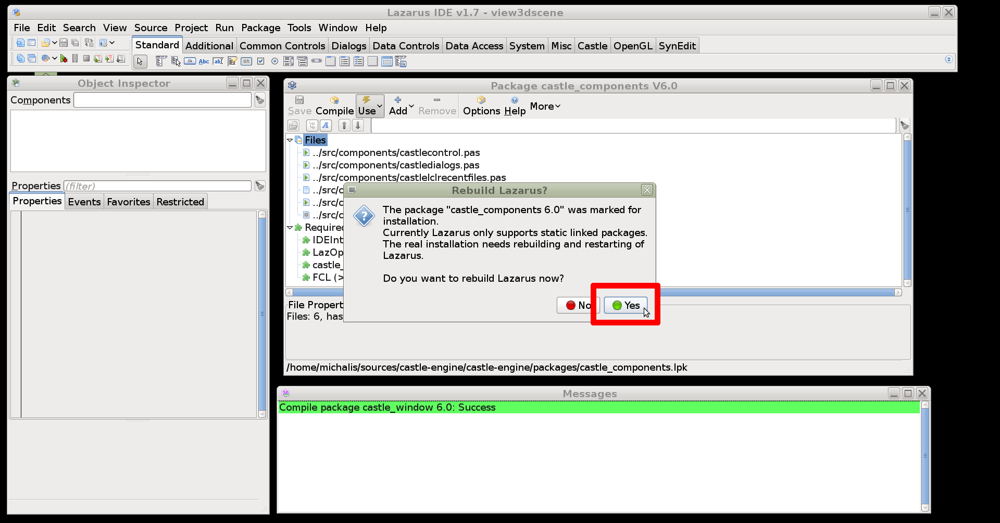

Next, I encourage you to test some of the engine numerous examples. I advice testing  `examples/fps_game/` (a complete game using the engine) and `examples/lazarus/model_3d_viewer/` (the engine control inside a Lazarus form). Simply open their project files (`.lpi`) in Lazarus and run them.

### Build Tool and the Upcoming Editor

The engine can also be used without Lazarus or LCL. We have our own build tool (called `castle-engine`) that can compile and package cross-platform applications. In particular, it can create a ready-to-install Android `.apk` file for your game. The build tool calls FPC and other tools under the hood.

//that manages projects described in a special `CastleEngineManifest.xml` file. The build tool

We will describe how to use the build tool to compile our demo game for Android in the later section _"Using the Build Tool to Compile for Android"_.

//See https://github.com/castle-engine/castle-engine/wiki/Build-Tool for details. This article will show you how to create a cross-platform using the engine, and yes, you can recompile it for any platform (including Android) using our build tool. We will describe this

We are also working on _Castle Game Engine Editor_ that allows to manage your projects and design the user interfaces and 3D and 2D game worlds visually. But it is not stable yet, so we will not use it in this article.

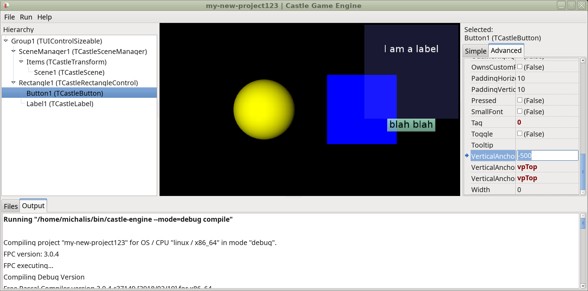

## Choosing How to Create a Window

You can use _Castle Game Engine_ in two ways:

1. Drop the `TCastleControl` visual component on a Lazarus form. This is great if you want to use Lazarus to create natively-looking user interface, and only use _Castle Game Engine_ to add some rendering inside a form.
//+
//Rejected, seems not necessary: screenshot of CGE inside Lazarus form
+
The `TCastleControl` is basically an OpenGL context with a lot of _Castle Game Engine_ features for rendering and input added.

2. Use `TCastleWindow` class as a container for the _Castle Game Engine_ rendering and input. This means that you don't use Lazarus forms and LCL at all. All the user interface is done using _Castle Game Engine_. `TCastleWindow` is a window containing only OpenGL (or OpenGLES) context.
//+
//Rejected, seems not necessary: screenshot of CGE (with the same model) inside own window
+
This is a better choice if you don't need natively-looking user interface, and prefer an interface custom to your application. This is a common approach for games. footnote:[`TCastleWindow` actually features natively-looking menu bar and dialog boxes. But that's it. Everything else is custom-drawn using OpenGL(ES) and Castle Game Engine.]
+
The main advantage of `TCastleWindow` is that it works on all platforms, including mobile (Android and iOS).
//It is also a bit simpler -- if all you want is a game window rendered using _Castle Game Engine_, then you simply don't need Lazarus LCL.
Mouse events (dragging and mouse look) are also processed smoother by our `TCastleWindow`, thanks to our own event loop.
// Using our build tool, you can trivially recompile your application for any supported platform, if only you use TCastleWindow in a proper way. There are some special additional rules to follow, e.g. mobile platforms support only 1 TCastleWindow per application, and almost all the initialization must happen in a unit (not the program lpr file, which is not used by the mobile platforms).
+
You can of course still use Lazarus as an IDE, to write and debug code. You will however not use Lazarus _form designer_ in this case.

This article will show the `TCastleWindow` method to initialize the window.

If you are unsure what to choose, _don't sweat it_. The _Castle Game Engine_ API is the same in both cases, and changing your mind later is not hard. The repository on https://github.com/castle-engine/blaise-pascal-article-examples contains two versions of our game -- one using `TCastleWindow` (in `3d_game` subdirectory) and the other using `TCastleControl` (in `3d_game_alternative_using_castlecontrol` subdirectory).

## Developing a Simple 3D Game

### Open a Window

This is the final version of our game, running on desktop and Android:

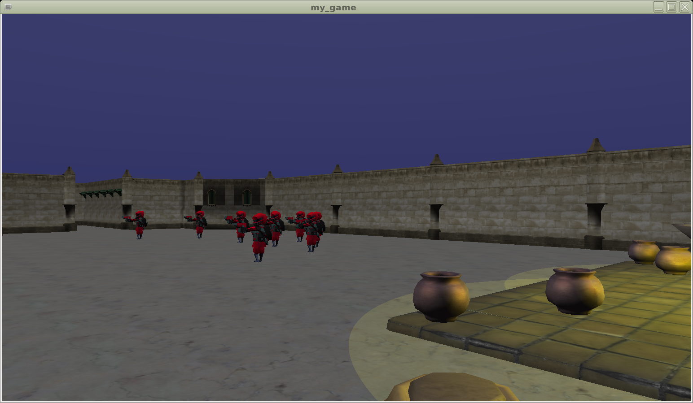

Start by creating a new project in Lazarus that uses `castle_window` package, and doesn't use LCL (_Lazarus Component Library_):

* Create a new project using Lazarus _"File -> New ..."_ menu item.
* Choose _"Project -> Simple Program"_ (or _"Custom Application"_ in older Lazarus versions).
* Using the _"Project -> Project Inspector"_ window add a _"New Requirement"_ and choose `castle_base` package. Then add another new requirement and choose `castle_window` package.
* Save your project using the menu item _"Project -> Save Project ..."_ under any name, like `my_game`.

Your application source code is now a single file `my_game.lpr`. It looks like this:

[source,pascal]
----
program my_game;

uses castle_base, castle_window;

begin
end.
----

To open a window, simply construct an instance of the `TCastleWindow` class. Then call the method `OpenAndRun` to open (show) the window and run the application.

To do this, use unit `CastleWindow`. You can also remove the package units `castle_base`, `castle_window` from your `uses` clause, they are not really necessary.

Here's the final code:

[source,pascal]
----
include::code-samples/window_initial/my_game.lpr[]
----

You can run it and be amazed by an empty black window that appears.

TIP: On Windows, you will notice an additional console window that appears each time you run the application. To avoid it, go to _"Project -> Project Options ..."_ dialog in Lazarus, and check the option _"Win32 GUI Application"_ on _"Compiler Options -> Config And Target"_ page. Alternatively, add `{$ifdef MSWINDOWS} {$apptype GUI} {$endif}` to the source code.

### Open a Window in a Cross-Platform Way

To make the application cross-platform, portable also to mobile platforms, you should move the window creation into a separate unit. The convention used throughout the engine examples is to call this unit `GameInitialize` or even just `Game`. The window should be created in the unit's `initialization` section and assigned to a special property `Application.MainWindow`.

Note that cross-platform applications are limited to using a single window, the one you set in `Application.MainWindow`. While on desktops you can create as a many `TCastleWindow` instances as you want, you don't have this luxury on other platforms.

The main program file only needs to call `Application.MainWindow.OpenAndRun;` now. On mobile platforms, the main program file will not be used. Instead, a special library will control the creation and display of the game window. This library will only include your units (`GameInitialize`  and anything else you use) to initialize and run the game. More details about compiling for mobile are available in the later chapter _"Using the Build Tool to Compile for Android"_ of this article. For now let's only make sure we are ready for this.

The new version of our application is split into two files.

1. The unit `GameInitialize` in file `gameinitialize.pas` with this content:
+
[source,pascal]
----
include::code-samples/window_cross_platform/gameinitialize.pas[]
----

2. The program in file `my_game.lpr` with this content:
+
[source,pascal]
----
include::code-samples/window_cross_platform/my_game.lpr[]
----

You can run the new version of the application. It will work the same as before (just show an empty window), but now it's a _cross-platform empty window_.

For more information about creating cross-platforms games see the documentation on https://castle-engine.io/manual_cross_platform.php .

### Load 3D Model

You're probably anxious at this point to display some cool 3D object using the engine. Let's do it.

First we need to get some sample 3D model. You can use a sample model of a soldier from https://github.com/castle-engine/blaise-pascal-article-examples/tree/master/3d_game/data/character .
//Be sure to download both the X3D file and the textures. (no textures now.)
Get the model in `.castle-anim-frames` format from there.
It is easiest to just download the complete repository https://github.com/castle-engine/blaise-pascal-article-examples/ and take the whole `3d_game/data/character` subdirectory from it.

To load a 3D model, you create an instance of `TCastleScene` class and use the `Load` method on it. `TCastleScene` is probably _the most important class_ in the entire _Castle Game Engine_, responsible for loading, animating and rendering game models.

Where should you load this? In applications using `CastleWindow`, it is best to perform the initialization of your game inside a callback assigned to the `Application.OnInitialize`. This callback is always run once, as soon as the engine is ready (all internal resources are initialized and the drawing context is ready), and before calling any other engine event.

Note that there are many other possibilities. In a Lazarus LCL application, you could create your model inside the `TForm.OnCreate` or `TForm.OnShow` event. In principle, you can create the `TCastleScene` and load it at any point during your game. In a cross-platform application you should only be careful to never load files before the `Application.OnInitialize` was called (in particular, _do not_ load files inside the unit's `initialization` clause).
//You should only be careful not to cause a slowdown in the middle of the application, by loading any file

Here's a working unit loading and displaying a 3D scene:

[source,pascal]
----
include::code-samples/load_3d/gameinitialize.pas[]
----

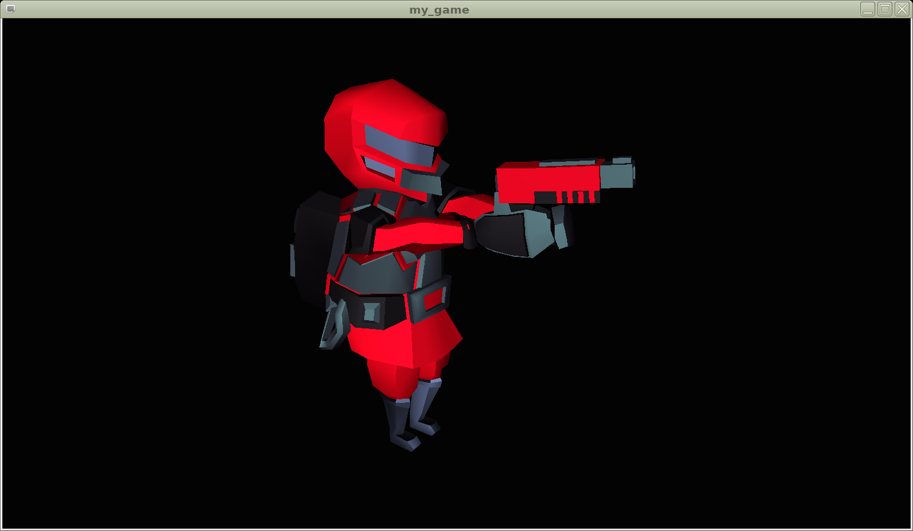

### What is a Scene Manager?

The above code also deals with something called `SceneManager`, an instance of the `TCastleSceneManager` class.

_Scene manager_ is a 2D user interface control that by default acts as a viewport (_rectangular area through which you see a 3D or 2D world_) and a central keeper of information (_what is contained in this world_). If you use `TCastleWindow` class (not just `TCastleWindowCustom`) then a default full-screen scene manager is already created for you and available in the `Window.SceneManager` property. A default scene manager is empty, and simply draws a black background.

In our above example, we have:

1. Added the scene to `SceneManager.Items`, to make it actually visible.

2. Set the scene as `SceneManager.MainScene`, to make it determine the initial headlight.footnote:[In new _Castle Game Engine_ 6.5, we could also set `SceneManager.Headlight := hlOn`, there's no need to set `SceneManager.MainScene` only for this purpose.]

More complicated games often deal with scene manager in a more complicated way.

*  You can create instances of `TCastleSceneManager` yourself, as many as you need, and show and hide them as necessary. You can avoid creating the default scene manager by using `TCastleWindowCustom` instead of `TCastleWindow`.

//you may prefer to avoid having a scene manager created by default. You should then create your window as an instance of `TCastleWindowCustom` instead of `TCastleWindow`. The property `SceneManager` is only available on `TCastleWindow`.
//+
//Note that if you use `TCastleWindowCustom`, you are responsible for making sure that there's always some control that draws over the entire screen. Otherwise screen contents are undefined. Possible solutions to this are to add a `TCastleSimpleBackground` instance to `Window.Controls`. Or add `TCastleRectangularControl` (with `FullSize` equal to `true`) to `Window.Controls`.
//+
//This way you can create and destroy your own scene manager instances at any point you need to.

* By default _scene manager_ is both a _viewport_ and a _keeper of information_. But you can add additional `TCastleViewport` instances (that refer to a central `TCastleSceneManager` instance) to display multiple views (from multiple cameras) of the same world. In this case you can also stop the scene manager from acting as a viewport by setting `SceneManager.DefaultViewport` to `false`.
//In such case, you are expected to render the world using `TCastleViewport` that only refers to the scene manager.

* By default _scene manager_ in opaque, filling the window with a black color underneath everything is renders. You can change it by changing the background color (`SceneManager.BackgroundColor := Vector4(1, 1, 0, 1);` or `SceneManager.BackgroundColor := Yellow;`), or making the scene manager transparent (`SceneManager.Transparent := true`).

* Just like all other user interface controls, you can change the size and placement of the scene manager. It doesn't have to fill the whole screen.
//You can make the scene manager not occupy the full screen by setting the `SceneManager.FullSize` to `false` and adjust the width, height and anchors. This works consistently on all _Castle Game Engine_ user interface controls and will be presented in the later chapter _"User Interface"_.

//* `TCastleScene` basically corresponds to one asset file you load -- one X3D or Collada or Spine JSON or other file, that you export from Blender or Spine or other authoring application.

// Note that we are simplifying a little. Actually scene manager doesn't have to be a viewport, it can only be a keeper of information. You can use other class, TCastleViewport, as a viewport displaying world defined in other TCastleSceneManager.

### Where to Keep Your Data?

It is best to place all your game data (models, textures, and everything else you may load) inside the `data` subdirectory of your project. This directory is a little special, as it will be automatically correctly packaged by the _build tool_ and available for your application on all platforms, including mobile Android and iOS. On Unix, the application data may also be installed system-wide.

We have a special URL protocol `castle-data:/` that allows to refer to the data files inside your project in a cross-platform, customizable way. Instead of

[source,pascal]
----
SoldierScene.Load('data/character/soldier1.castle-anim-frames');
----

you can write this:

[source,pascal]
----
SoldierScene.Load('castle-data:/character/soldier1.castle-anim-frames');
----

This will work on all platforms.

Using `castle-data:/` everywhere allows you to also customize the `data` directory location in the future, if needed.
Refer to the API reference of `ApplicationDataOverride` for details -- how it is auto-detected, and how to customize it. More information about the `data` directory is in our manual: https://castle-engine.io/manual_data_directory.php .

TIP: *There is no other directory name that is "special" for Castle Game Engine*. All other directory names you invent yourself, and organize your data and code however you like.

TIP: Using `castle-data:/` is a good approach for typical games, that are distributed with a read-only game data. You do not _have_ to use it. For example a general 3D model viewer or editor can just open 3D models from any user-specified URL (like a file or HTTP resource), not only from `castle-data:/`.

### Examine Camera

If you click and drag around, you will notice that camera navigation already works. The engine created by default a camera that matches the position and size of your scene. And by default it uses the _"Examine"_ navigation type, which allows to comfortably drag and scroll to inspect the model.

Many camera settings can be configured inside the model file assigned to the `SceneManager.MainScene`. As it happens, our `soldier1.castle-anim-frames` doesn't set anything, but other model could. For example, if your model in Blender has a _Blender camera object_ then it will determine the default camera position and orientation.

Camera settings can also be adjusted by Pascal code. We will do this in the section _"Walk Camera"_ later.

### Play Animation

To play an animation, simply call the `TCastleScene.PlayAnimation` method with the name of your animation.
//The underlying animation mechanism is very
//features a powerful method to play animations. You

You also have to make sure that the scene processes _events_, which is a general mechanism responsible for any dynamic changes in a scene. To do this, set the `TCastleScene.ProcessEvents` property to true.

This is the code you can add at the end of `ApplicationInitialize`:

[source,pascal]
----
SoldierScene.ProcessEvents := true;
SoldierScene.PlayAnimation('walk', true);
----

The 2nd parameter of `PlayAnimation` determines should the application repeat in a loop.
// footnote:[In new _Castle Game Engine_ 6.5 there is an easier overloaded version that just takes a boolean value that determines should the animation loop.].
Since _Castle Game Engine_ 6.5 there is also an overloaded version of `PlayAnimation` that allows to set more options through `TPlayAnimationParameters`, and allows to play animation backwards, blend (cross-fade) the animation with the previously playing animation, get a notification when animation stops and more.

To know what animations are supported on a given model, it's easiest to open the model with our tool `view3dscene`. You can download it from https://castle-engine.io/view3dscene.php . You can see the available animations, and try them out, in view3dscene.

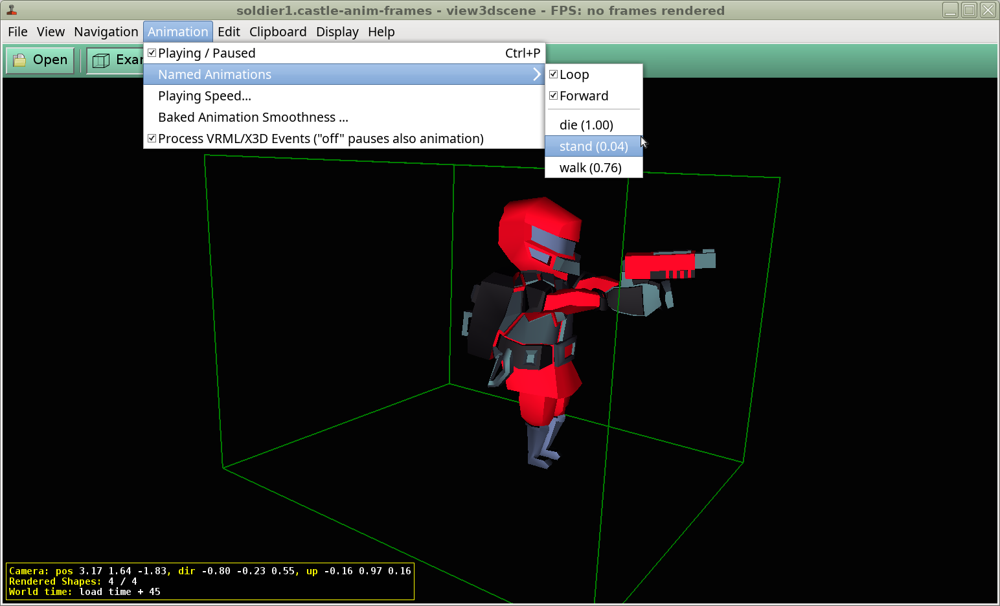

This information is of course also available through the _Castle Game Engine_ API. Use `TCastleScene` methods `AnimationsList`, `HasAnimation` and `AnimationDuration`.

The animation names are set within your 3D modeling software. In case of exporting from Blender to `castle-anim-frames` format, the animation names simply correspond to Blender's _action_ names.

### React to User Input

Our `soldier1.castle-anim-frames` model has three animations: `die`, `stand`, `walk`. In the future, we will want these animations to be controlled through some game logic. But for now, let's simply test whether they look good, by switching the current animation when we press keys `1`, `2` or `3`.

To react to user pressing something (a key, a mouse button, a touch on mobile device) it is easiest to assign a procedure to the `Window.OnPress` event. The event gets a parameter that says what key was pressed.

. Somewhere in your `ApplicationInitialize` add this:
+
[source,pascal]
----
Window.OnPress := @WindowPress;
----

. Define (_above_ the `ApplicationInitialize`) a new procedure `WindowPress`, like this:
+
[source,pascal]
----
procedure WindowPress(Container: TUIContainer; const Event: TInputPressRelease);
begin
  if Event.IsKey('1') then
    SoldierScene.PlayAnimation('walk', true)
  else
  if Event.IsKey('2') then
    SoldierScene.PlayAnimation('stand', true)
  else
  if Event.IsKey('3') then
    SoldierScene.PlayAnimation('die', true);
end;
----

. Add `CastleKeysMouse` to the `uses` clause of your unit, in order to have the identifier `TInputPressRelease` available.

That's it. You can now switch the soldier's animation by pressing the appropriate key.

Larger games typically have many states, like _main menu_, _playing game_ and _game paused_. It would be uncomfortable to handle everything in one central `Window.OnPress` handler in such case. Instead, you can use the `TUIState` class. You can create multiple `TUIState` descendants, like `TMainMenuState`, `TPlayGameState`, `TGamePausedState`. Each descendant can override `TUIState.Press` to provide it's own input handling.

Conceptually, this is very similar to having multiple `TForm` instances in a regular Lazarus LCL or Delphi VCL application. Our `TUIState` has various special features, e.g. you can have a stack of states, so that a _paused state_ is displayed on top of a (possibly frozen) _game state_.

In general, you can create custom `TUIControl` descendants, and check pressed keys within the `TUIControl.Press` overridden method. The `TUIState` class is only a special `TUIControl` descendant. Our documentation https://castle-engine.io/manual_2d_user_interface.php describes `TUIControl` and `TUIState` in more details.

### Load 3D Model of the Game Level

Let us add to the game world (`SceneManager.Items`) another 3D model, representing a level. This is simply a matter of creating a new `TCastleScene` instance and adding it to the `SceneManager.Items`, alongside existing `SoldierScene`.

We also want the level scene to define lights that shine on *all* other scenes, including the soldier. To do this, we change `SceneManager.MainScene` to point to the new `LevelScene`, not `SoldierScene`. The lights in `MainScene` automatically shine on all scenes (thanks to `SceneManager.UseGlobalLights`).

In summary, this is the new code of our `ApplicationInitialize`:

[source,pascal]
----
procedure ApplicationInitialize;
begin
  Window.OnPress := @WindowPress;

  SoldierScene := TCastleScene.Create(Application);
  SoldierScene.Load('castle-data:/character/soldier1.castle-anim-frames');
  SoldierScene.ProcessEvents := true;
  SoldierScene.PlayAnimation('walk', true);
  Window.SceneManager.Items.Add(SoldierScene);

  LevelScene := TCastleScene.Create(Application);
  LevelScene.Load('castle-data:/level/level-dungeon.x3d');
  Window.SceneManager.Items.Add(LevelScene);

  Window.SceneManager.MainScene := LevelScene;
end;
----

Be sure to also declare the variable `LevelScene: TCastleScene` somewhere above, alongside the `SoldierScene`. It could also be declared as a local variable within `ApplicationInitialize` in this simple example.

To make the lighting on our level be rendered with better quality, you can use _Phong shading_. Simply add this line somewhere at the end of `ApplicationInitialize`:

[source,pascal]
----
LevelScene.Attributes.PhongShading := true;
----

You can get a sample model of a level from our repository https://github.com/castle-engine/blaise-pascal-article-examples/ . The sample level is inside the `3d_game/data/level/` subdirectory. It is a Blender model (`level-dungeon.blend`) exported to an X3D (`level-dungeon.x3d`) format.

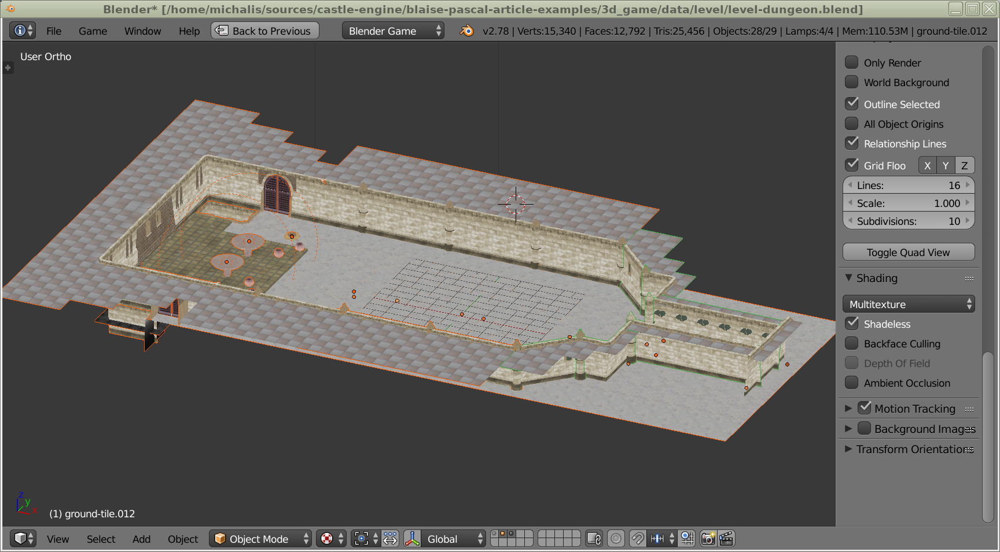

The level refers to a number of textures inside the `textures/` subdirectory. The `level-dungeon.x3d` refers to the textures using a relative path, like `url="textures/wall-tex-1.jpg"` (simplifying a little). This means that you can copy the entire model to your project, under any subdirectory you like, just make sure to keep the `textures` directory alongside the `level-dungeon.x3d` file.

You can run the game now, and behold two 3D models displayed at once.

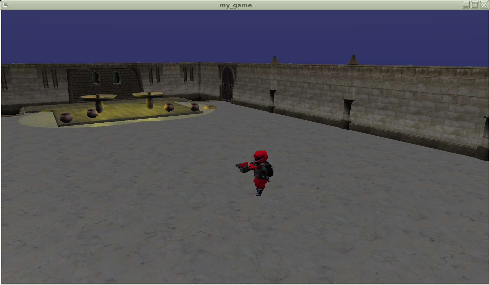

### Walk Camera

The engine features a ready implementation of a _walking_ or _flying_ camera. It automatically responds to the typical keys used in 3D games, so you can move using arrow keys or AWSD key combination. The camera can also be affected by gravity, so you are pulled down in the negative Y axis (by default) until you stand on the ground.

To switch to _walk_ navigation, simply add this line to the `ApplicationInitialize` procedure:

[source,pascal]
----
Window.SceneManager.NavigationType := ntWalk;
----

There are other navigation types, like `ntFly`, `ntNone`, `ntExamine`. Using the _None_ navigation type you can disable any built-in camera navigation, so that camera will stay completely stationary, regardless of pressed keys, gravity and collisions. You are expected then to implement 100% of the camera navigation yourself. You can set camera position and orientation using the appropriate methods, like `SceneManager.WalkCamera.Position` or `SceneManager.WalkCamera.SetView`.

For this demo, the `ntWalk` navigation will be a good starting point.

The navigation mode constants are defined in the `CastleCameras` unit, so add it to your `uses` clause.

Let's make the camera move a little faster than default, by adding this command:

[source,pascal]
----
Window.SceneManager.WalkCamera.MoveSpeed := 10;
----

We should also set a good camera starting point. There are many ways to do this.

For this demo, I advice using `view3dscene` to determine best camera position and orientation. _View3dscene_ is a model browser developed using _Castle Game Engine_. It can open anything that our engine can open, and it can be used to test engine rendering, animations and more. You can download it from https://castle-engine.io/view3dscene.php . Open the level model in `view3dscene`, navigate to a proper place (you can use camera _Examine_ or _Walk_ modes interchangeably), and then look at `view3dscene` status bar that shows camera position, direction and up. Simply copy these values (you can use the menu item _"Clipboard -> Print Current Camera (Viewpoint) (Pascal)"_ since view3dscene 3.19.0). See the screenshot below.

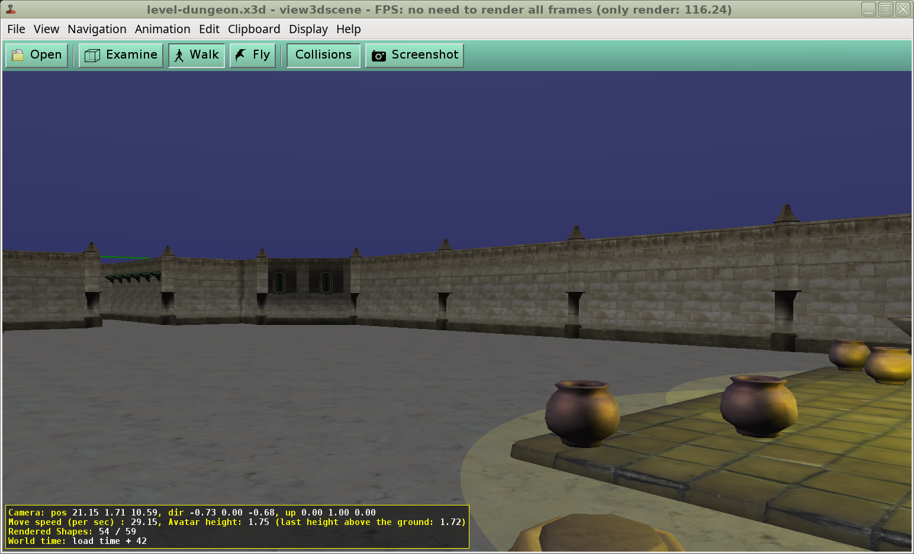

This is one possible camera starting point:

[source,pascal]
----
Window.SceneManager.WalkCamera.SetView(
  Vector3(21.15, 1.71, 10.59), // position
  Vector3(-0.73, 0.00, -0.68), // direction
  Vector3(0.00, 1.00, 0.00), // up (current)
  Vector3(0.00, 1.00, 0.00) // gravity up
);
----

The `Vector3` function is available in the unit `CastleVectors`. Be sure to add it to your uses clause.

In order for collisions with level to work precisely, you also need to add `ssDynamicCollisions` to the `LevelScene.Spatial` property. Otherwise, the `LevelScene` will collide as a one giant box, and you will not be able to move inside the level.

It is also a good idea to add `ssRendering` to `LevelScene.Spatial` property, while we're at it. This enables _frustum culling_, which is a good optimization when scene has many shapes, and often some of them are completely outside of the camera view (frustum). This is typically a useful optimization for game levels.

In summary, add this to the `ApplicationInitialize`:

[source,pascal]
----
LevelScene.Spatial := [ssRendering, ssDynamicCollisions];
----

You can now run the game, and freely walk using the AWSD and arrow keys.

TIP: Would you like to add *mouse look*, to enable rotating the camera by moving the mouse? Go for it! Handle in `WindowPress` some key and toggle the boolean property `Window.SceneManager.WalkCamera.MouseLook`. When it is `true`, the mouse cursor is invisible, and moving the mouse rotates the camera.

### Enemy Intelligence

Right now, our enemy (the soldier model) just stands in place at the middle of the level. Let's implement a simple logic of a moving enemy. Let's also make it reusable, such that we will be able to spawn multiple soldiers in the future.

To implement enemy logic we need to react to an _update_ event of the engine. The engine makes sure that such event occurs regularly. In the typical circumstances, it just occurs as often as we render a frame. There are various ways to handle this event, for example you can assign some procedure to `Window.OnUpdate`, or you can override the `TCastleTransform.Update` or `TUIControl.Update` methods.

For this demo, we will create a new class called `TEnemy` that descends from `TCastleTransform`. We will override `TCastleTransform.Update` method.

What is a `TCastleTransform`?

* It is a group of 3D or 2D game objects. The children of `TCastleTransform` are added using the `TCastleTransform.Add` method, and they can be any other `TCastleTransform` instances. In particular, our familiar `TCastleScene` is a descendant of `TCastleTransform`, so it can also be a child of `TCastleTransform`.

* `TCastleTransform` can move (translate), rotate and scale the children.

//`TCastleTransform`  can be added to the game world (`SceneManager.Items`), just like `TCastleScene` (in fact, `TCastleScene` is just a descendant of `TCastleTransform`).

In the case of our `TEnemy`, it will be a descendant of `TCastleTransform`, and it will contain exactly one child: a `TCastleScene` displaying the soldier. Other class designs are possible, for example we could implement `TEnemy` as a descendant of a `TCastleScene`. But I found the approach presented here most flexible. It allows to easily experiment and e.g. replace the visible portion of the enemy, or compose it from multiple scenes.

In the overridden `TEnemy.Update`, we will change our  own `Translation` value. The `Translation` is a 3D vector (`TVector3` type).

Notes about changing `Translation` in `Update`:

* Everything you do inside the `Update` should be scaled by a `SecondsPassed` parameter. `SecondsPassed` is the fraction of a second (as a floating-point value) that passed since the last `Update` call. For example, to move with a speed of 10 units per seconds, _do not_ do this:
+
[source,pascal]
----
Translation := Translation + Vector3(10, 0, 0);
----
+
Instead do this:
+
[source,pascal]
----
Translation := Translation + Vector3(10 * SecondsPassed, 0, 0);
----
//To work in all circumstances, the implementation should not assume a particular frequency of the s. Instead check the value  at each `Update` call and adjust the movement and other actions to it. This is called a "time-based animation".
//To modify the `TCastleTransform.Translation`, one sim

* By default, in _Castle Game Engine_, Y is the vertical axis, along which gravity works. So to make a horizontal movement, we move along the X and/or Z axis. This is consistent with default X3D, OpenGL, 2D conventions, and other game engines.
+
Note that various 3D modeling software (like _Blender_) by default follow a different convention, in which Z is the vertical axis. However exporters (e.g. from _Blender_ to X3D) will rotate your model to turn Z axis into Y axis.
//+
//This is configurable on the _Castle Game Engine_ side, and you could use the convention that _Z axis is vertical_, if you like. But it also requires selecting special options at every export (to avoid the rotation mentioned above). Usually it is easier to just follow the defaults.

This is the first version of our `TEnemy` class:

[source,pascal]
----
include::code-samples/enemy_1/enemy_class.pas[]
----

As you can see, we have moved the creation of the `SoldierScene` to the `TEnemy` constructor, and the `SoldierScene` is now a field inside each `TEnemy` instance. You should now remove the global `SoldierScene` variable and instead add `TEnemy` instance to the `SceneManager.Items` inside `ApplicationInitialize`, like this:

[source,pascal]
----
procedure ApplicationInitialize;
var
  Enemy: TEnemy;
begin
  // ...

  { These two lines should replace previous code
    dealing with SoldierScene.
    Keep the rest of ApplicationInitialize intact. }
  Enemy := TEnemy.Create(Application);
  Window.SceneManager.Items.Add(Enemy);

  // ...
end;
----

Note that it is also time to remove the debug code inside `WindowPress` that changes `SoldierScene` animation. In principle, we could add it now to overridden `TEnemy.Press`, but in the long run we want our game logic to dictate the animations of our enemy.

Be sure to add `CastleTransform` and `Classes` to the `uses` clause, to make the necessary types available.

There is one final tweak we should make: right now the enemy never rotates, so sometimes he walks backwards. To fix this, we should adjust the rotation of the transformed model.

One way to do this would be to change the `TCastleTransform.Rotation` property. It is a 4D vector, where the first 3 components describe the axis of rotation, and the 4th component is the rotation angle _in radians_.

However, rotating the creature using the `Rotation` property is not very comfortable. It tells the engine _how to rotate the loaded model_, but we would prefer to tell the engine _in which direction should the soldier look_. To do this, you can assign a `Direction` property, that (together with `Up`) actually modifies the `Rotation` under the hood.

Thanks to this, we can trivially enhance our `TEnemy.Update` implementation. Simply add there this line:

[source,pascal]
----
Direction := Vector3(0, 0, MoveDirection);
----

The enemy now rotates and always walks forward in our game.

// [NOTE]
// ====
// In order for the `Direction` property to work intuitively, you need to make sure that your models are oriented (at loading time) as necessary. The engine must know how to convert between a `Direction` and `Rotation`. E.g. the engine must know what is the `Direction` when `Rotation` is zero.
//
// This is determined using the `TCastleTransform.DefaultOrientation` and `TCastleTransform.Orientation` properties. By default they are consistent with _Blender_ and with the Blender's X3D exporter behavior. If you design your model such that it follows the conventions of _Blender_ views called _Top_, _Front_ and _Side_, then the `TCastleTransform.Direction` will automatically behave correctly in our engine.
// ====

[TIP]
====
If you'd like, you can implement much more intelligent enemy that respects level's collision structure. The enemy can test the world around him using methods like `LineOfSight`, `Height`, `MoveAllowed`.
//Our engine features some ready intelligent enemies in unit `CastleCreatures`.
====

### Spawning Multiple Enemies

Since we have created a nice reusable class `TEnemy`, it's only fair to use it to spawn multiple enemies. Do this by creating a couple of `TEnemy` instances.

Replace the previous code creating a single `Enemy` with the snippet below to create 10 enemies. Each enemy starts at a different X and Z coordinate.

[source,pascal]
----
for I := 0 to 9 do
begin
  Enemy := TEnemy.Create(Application);
  Enemy.Translation := Vector3(-5 + I * 1.5, 0, RandomFloatRange(-5, 5));
  Window.SceneManager.Items.Add(Enemy);
end;
----

Add `CastleUtils` unit to the `uses` clause to have `RandomFloatRange` routine available.

You can try this code and it will work correctly. Multiple enemies walk in the world. However... the game loads surprisingly slow. The creation of 10 enemies takes a noticeable time.

TIP: You could use `ProcessTimer` from the `CastleTimeUtils` unit to actually _measure_ the time spent within some part of the code, like the loop above.

The reason of the large loading time is that each `TEnemy.Create` loads the `soldier1.castle-anim-frames` file from disk, calling the `SoldierScene.Load(...)`. Loading stuff from disk always takes a while, and here we do it 10 times when in fact we should load it from disk only once. As it happens, the `castle-anim-frames` file is also a bit large (animations in other formats would load much faster).

A more efficient solution is to create a single `TCastleScene` instance (let's call it `SoldierSceneTemplate`) and within each `TEnemy.Create` only call `SoldierScene := SoldierSceneTemplate.Clone`. The `Clone` method creates a copy of the scene. The clone looks and behaves the same, but is independent from the original. Each scene clone may be in a different state (e.g. play a different animation).

Do it like this:

. Declare variable `SoldierSceneTemplate: TCastleScene` at the beginning of the unit implementation.

. At the beginning of `ApplicationInitialize` (before the loop doing `TEnemy.Create`) initialize `SoldierSceneTemplate` like this:
+
[source,pascal]
----
SoldierSceneTemplate := TCastleScene.Create(Application);
SoldierSceneTemplate.Load('castle-data:/character/soldier1.castle-anim-frames');
----

. Change `TEnemy` constructor to use `SoldierSceneTemplate.Clone`:
+
[source,pascal]
----
constructor TEnemy.Create(AOwner: TComponent);
begin
  inherited;

  MoveDirection := -1;

  SoldierScene := SoldierSceneTemplate.Clone(Self);
  SoldierScene.ProcessEvents := true;
  SoldierScene.PlayAnimation('walk', true);

  Add(SoldierScene);
end;
----

You should test the new version and see that it loads much faster.

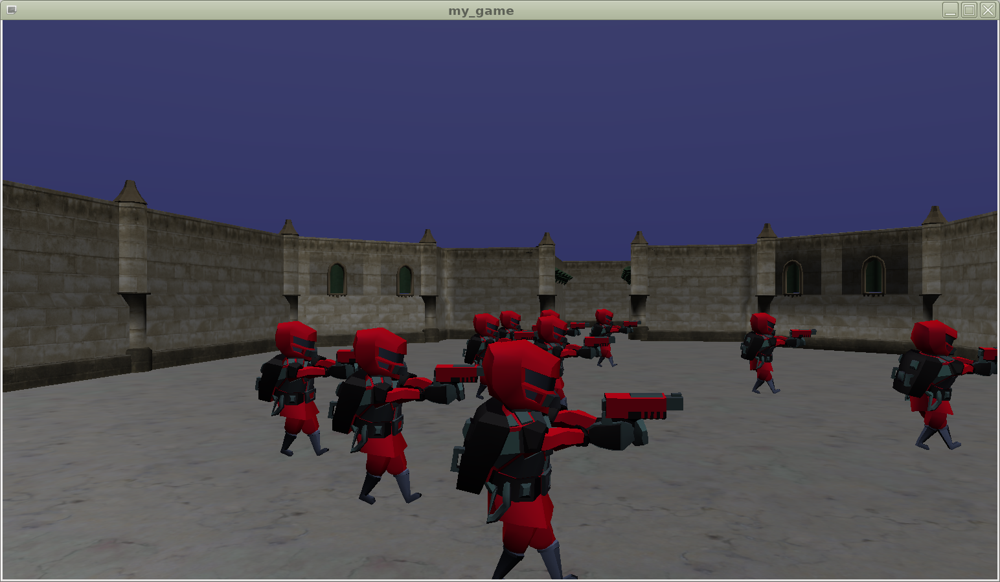

NOTE: In this simple example, we could also just add the `SoldierSceneTemplate` instance as a child of `TEnemy`, without even calling `SoldierSceneTemplate.Clone`. It is allowed to place the same `TCastleScene` multiple times in the world, and everything would work. However, all the enemies would then always have to play the same animation at the same time. This would prevent us from switching some enemies to `die` animation, which we will do in the next chapter.

### Shooting at Enemies

This section shows how to implement (instantaneous) shooting or picking objects using _Castle Game Engine_.

The engine tracks the object under the mouse cursor, and exposes it under the `SceneManager.MouseRayHit` property. If `SceneManager.MouseRayHit` is `nil`, then we are not pointing the mouse at anything collidable. Otherwise `SceneManager.MouseRayHit` is a list of `TCastleTransform` instances that are hit by the ray. The first item on this list is the `TCastleScene` with which the collision occurred, and the following items are parent `TCastleTransform` instances of this scene.

In our case, we know that `TEnemy` instance is always a direct parent of a `TCastleScene` showing the enemy. Therefore we can check whether `SceneManager.MouseRayHit[1]` (a _second_ object on this list) corresponds to a `TEnemy` class.

This is a new implementation of our `WindowPress` procedure that detects when we shoot the enemy.

[source,pascal]
----
procedure WindowPress(Container: TUIContainer; const Event: TInputPressRelease);
var
  HitEnemy: TEnemy;
begin
  if Event.IsMouseButton(mbLeft) then
  begin
    if (Window.SceneManager.MouseRayHit <> nil) and
       (Window.SceneManager.MouseRayHit.Count >= 2) and
       (Window.SceneManager.MouseRayHit[1].Item is TEnemy) then
    begin
      HitEnemy := Window.SceneManager.MouseRayHit[1].Item as TEnemy;
      HitEnemy.SoldierScene.PlayAnimation('die', paForceNotLooping);
      HitEnemy.SoldierScene.Pickable := false;
      HitEnemy.SoldierScene.Collides := false;
      HitEnemy.Dead := true;
    end;
  end;
end;
----

When the enemy is hit, we do a couple of things:

. Change enemy's animation to `die`.
. Set a new boolean field `TEnemy.Dead` that you can use to stop moving the dead enemy inside `TEnemy.Update`.
. Disable `Pickable` of `TEnemy`, to prevent it from being detected as shot again.
. Disable `Collides` of `TEnemy`, to allow to easily walk over corpses of your enemies.

Note that this also works on mobile, and when we use mouse look. The `SceneManager.MouseRayHit` always corresponds to the last thing hit by the pointer (mouse or touch). In case of mouse look, the cursor is always in the middle of the screen.

//We have an unused animation called `die` on our enemy model.

NOTE: There are other places that contain detailed information about the picked object. `SceneManager.TriangleHit` describes the details of a triangle under the mouse. You can also call collision routines like `SceneManager.Items.WorldRay` to pick using any ray (not necessarily corresponding to the current mouse position).

### Playing Sound and Music

At the end, we can add some sound and music to the game. It's so easy and fun that it would be a shame not to do this.

_Castle Game Engine_ has a powerful audio support in the `CastleSoundEngine` unit. This unit exposes `SoundEngine` singleton which is a central place to initialize and play sounds. You can load sound files in `.wav` or `.ogg` (OggVorbis) formats. Sounds can be looping and you can tweak various parameters, like volume and pitch of each sound. Sounds can even be spatial, which means that they play in the proper channel (left, right or other) with the appropriate intensity, depending on their relative position to the player in 3D.

For starters, it is easiest to define a set of named sounds using a special XML file.

//You can find a lot of good quality sounds by searching the Internet.
We have included some sample audio files in the https://github.com/castle-engine/blaise-pascal-article-examples/ repository, in the subdirectory `3d_game/data/audio/`. They were created by https://opengameart.org/ contributors, their details are in the `3d_game/data/AUTHORS.txt` file. The instructions below assume you have copied the `dark_fallout.ogg` and `flaunch.wav` files to your project, to the subdirectory `data/audio/`.

Create the following text file, and save it as `data/audio/index.xml` within your project:

[source,xml]
----
<?xml version="1.0" encoding="utf-8"?>
<sounds>
  <sound name="dark_music" url="dark_fallout.ogg" />
  <sound name="shoot_sound" url="flaunch.wav" />
</sounds>
----

Now you can initialize sounds inside `ApplicationInitialize` by loading this file:

[source,pascal]
----
SoundEngine.RepositoryURL := 'castle-data:/audio/index.xml';
----

To play music simply set `SoundEngine.MusicPlayer.Sound`. You can do this from `ApplicationInitialize`, right after the line above:

[source,pascal]
----
SoundEngine.MusicPlayer.Sound := SoundEngine.SoundFromName('dark_music');
----

Finally, to play the shooting sound, call the `SoundEngine.Sound` method. You can place this inside the `WindowPress` procedure:

[source,pascal]
----
SoundEngine.Sound(SoundEngine.SoundFromName('shoot_sound'));
----

This is it. You should now hear music and shooting sounds in your game.

[NOTE]
====
You need to have the appropriate libraries installed to be able to play sounds and load OggVorbis music file.

* Under Linux, you should install appropriate packages.
* Under Windows, you should get the appropriate `.dll` files and place them alongside your `.exe` file. The necessary files are inside the _Castle Game Engine_ zip that you already downloaded, look in the `tools/build-tool/data/external_libraries/` subdirectory.

See https://castle-engine.io/documentation.php for more details.
====

## Building An Android Version

### Using the Build Tool to Compile for Android

To enable compiling the application with our _build tool_, create a file `CastleEngineManifest.xml` in the main project directory.

The main purpose of this file is to specify the `game_units` attribute. It tells us which unit is responsible for creating a window (`Application.MainWindow`). This is the `GameInitialize` unit in our case. When compiling for Android or iOS,
//we cannot use the program's `.lpr` file.
we create a special library which will use the units mentioned in the `game_units` attribute.
// (and the units used by them, in turn).
The window creation will be controlled by this library.
// This library has to use your `GameInitialize` to actually initialize and show your game.

These are the contents of a simple `CastleEngineManifest.xml` file:

[source,xml]
----
<?xml version="1.0" encoding="utf-8"?>
<project name="my_game"
  standalone_source="my_game.lpr"
  game_units="GameInitialize">
  <!--
    Using "integrated" project type will automatically
    include sound libraries (OpenAL, OggVorbis).
  -->
  <android project_type="integrated"/>
</project>
----

Many more interesting things can be specified there, see the documentation on https://github.com/castle-engine/castle-engine/wiki/CastleEngineManifest.xml-examples .

Now you will need to get our _build tool_, which is an executable called `castle-engine`. For now, you simply have to compile it yourself. You can open the project `castle_game_engine/tools/build-tool/code/castle-engine.lpi` and compile it from Lazarus. The resulting application (`.exe` file on Windows) is compiled to `castle_game_engine/tools/build-tool/` directory.

Finally, adjust the environment variables.

* You want to set the environment variable `CASTLE_ENGINE_PATH` to point to the directory containing the `castle_game_engine`, like `c:/my_projects/castle_game_engine` or `/home/me/my_projects/castle_game_engine` . If you don't know how to set an _environment variable_, please search it on the Internet, there are step-by-step instructions available for every operating system.

* You also want to adjust your environment variable `PATH` such that it points to the location where the compiled build tool is. For example, to `c:/my_projects/castle_game_engine/tools/build-tool/` or `/home/me/my_projects/castle_game_engine/tools/build-tool/`. Again, if are unsure how to do this, please search the Internet.

In the next engine release, we will provide precompiled binaries of various tools (like `castle-engine` and `castle-editor`) that will make most of the above steps not necessary.

Once you have done this, you should be able to open a _console_ and execute this:

```
castle-engine --version
```

In response, it should show the _Castle Game Engine_ version.

Now enter (`cd ...`) into the directory of your project. You can compile and run it for your current (desktop) system by executing these commands:

```
castle-engine compile
castle-engine run
```

To compile and run it on Android, install _Android SDK_ and FPC able to cross-compile for Android (see the documentation on https://github.com/castle-engine/castle-engine/wiki/Android ). Then execute this:

//# Compile and create apk
//# Install apk on the phone (connected through the USB cable)
//# Run installed application on the phone (and display log)

```
castle-engine package --os=android --cpu=arm
castle-engine install --os=android --cpu=arm
castle-engine run --os=android --cpu=arm
```

This will compile and create (`package`) Android apk file, install it on your phone (connected through the USB cable) and run the application (displaying the log).

See the https://github.com/castle-engine/castle-engine/wiki/Build-Tool for more details about using the build tool.

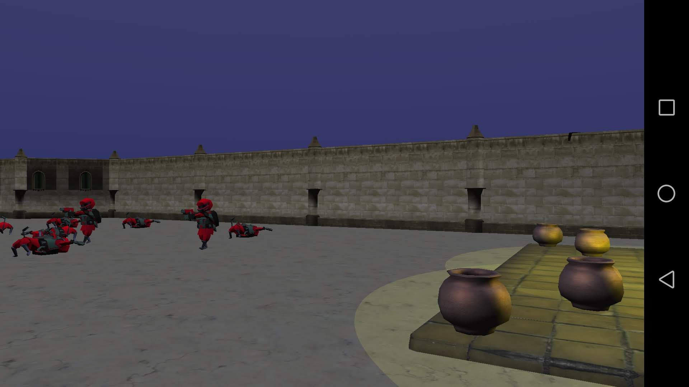

### Cross-platform Logging

It's a good idea to initialize logging as early as possible. To do this, add these lines at the beginning of your unit `initialization` section:

[source,pascal]
----
ApplicationProperties.ApplicationName := 'my_game';
InitializeLog;
----

Make sure to also add `CastleApplicationProperties` and `CastleLog` units to your `uses` clause.

The engine automatically logs some important events (like creation of the drawing context). You can also use yourself routines like `WritelnLog` and `WritelnWarning` to send information to the log.

## Conclusion

I hope that this article encouraged you to develop cool games using _Castle Game Engine_. If you get lost, please remember that we have a ton of documentation on our website https://castle-engine.io/ : manual, API reference, introduction to the modern Pascal language, and more. And we are a welcoming community! You can post on our Discord or forum (see https://castle-engine.io/talk.php ) and we'll be happy to help.

Consult also the examples code and data on https://github.com/castle-engine/blaise-pascal-article-examples .

Now, all you need to do is to take this variable and call it `PlayerHealth`. And another one, and it will be...
